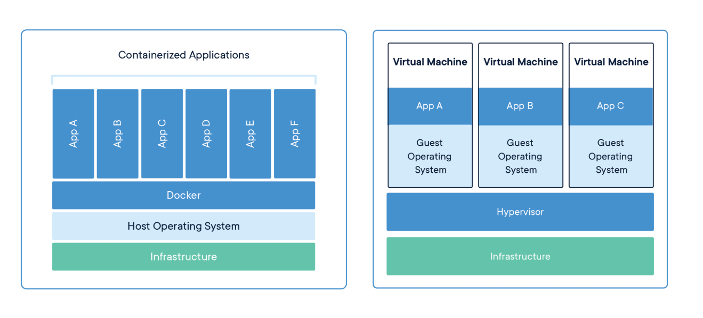

# Guia Essencial de Containers com Docker

## Introdução aos Containers e Docker

### O que são Containers?
Containers são uma solução leve e eficiente para empacotar aplicações e suas dependências, garantindo que elas rodem de forma consistente em qualquer ambiente. Em vez de depender da configuração do sistema operacional subjacente, os containers criam um ambiente isolado, o que reduz conflitos entre diferentes sistemas e facilita a implantação.

### Principais Vantagens dos Containers

- **Ambiente Padronizado**: Como o container inclui todas as dependências da aplicação, ele garante que o software funcione da mesma forma em qualquer ambiente.
- **Isolamento**: Cada container opera de maneira independente, sem interferir em outros processos do sistema. Isso aumenta a segurança e a estabilidade das aplicações.
- **Eficiência**: Diferente das máquinas virtuais, os containers compartilham o kernel do sistema operacional do host, tornando sua execução mais leve e rápida.
- **Escalabilidade**: Como a inicialização dos containers é quase instantânea, eles facilitam a escalabilidade dinâmica de aplicações.
- **Portabilidade**: Um container pode ser executado em qualquer sistema que tenha um runtime compatível, eliminando o clássico problema de diferenças entre ambientes de desenvolvimento e produção.

### Containers vs. Máquinas Virtuais

#### Máquinas Virtuais (VMs)
- Executam um sistema operacional completo sobre um hypervisor.
- São mais pesadas, pois precisam virtualizar todo o hardware.
- O tempo de inicialização pode ser longo, semelhante ao boot de um sistema físico.
- Proporcionam um isolamento total entre aplicações, pois cada VM opera como um ambiente independente.

#### Containers
- Compartilham o kernel do sistema operacional do host.
- São mais leves e iniciam rapidamente, consumindo menos recursos.
- Oferecem isolamento suficiente para a maioria das aplicações, sem a necessidade de um SO completo por instância.
- Permitem uma maior densidade de execução, já que vários containers podem rodar simultaneamente com baixo consumo de recursos.

## O Papel do Docker

O Docker é uma das tecnologias mais utilizadas para gerenciamento de containers. Ele simplifica a criação, distribuição e execução de containers, oferecendo um conjunto de ferramentas para facilitar o desenvolvimento e a implantação de aplicações.

### Componentes do Docker
- **Docker Engine**: Responsável pela execução e gerenciamento de containers.
- **Docker CLI**: Interface de linha de comando utilizada para interagir com o Docker Engine.
- **Docker Hub**: Repositório online onde imagens de containers podem ser armazenadas e compartilhadas.
- **Docker Compose**: Ferramenta que permite definir e gerenciar aplicações compostas por múltiplos containers.

### Docker CE vs. Docker Desktop
- **Docker CE (Community Edition)**: Versão gratuita e open source, ideal para desenvolvedores e pequenas equipes.
- **Docker Desktop**: Inclui Docker Engine, CLI e ferramentas adicionais para desenvolvimento em Windows e macOS.

## Open Container Initiative (OCI)

A Open Container Initiative (OCI) é um esforço colaborativo que busca padronizar a criação e execução de containers. Isso garante que diferentes runtimes e ferramentas possam trabalhar de maneira integrada, promovendo maior interoperabilidade no ecossistema de containers.

### Objetivos da OCI
- **Criar padrões abertos** para o formato de imagens de containers.
- **Garantir compatibilidade** entre diferentes tecnologias de containerização.
- **Evitar dependência de fornecedores** específicos, permitindo liberdade de escolha para desenvolvedores.

## Conclusão

A adoção de containers transformou a forma como as aplicações são desenvolvidas, implantadas e gerenciadas. O Docker desempenhou um papel fundamental nessa revolução, tornando a tecnologia acessível e fácil de usar. Com os padrões da OCI, a tendência é que a interoperabilidade entre ferramentas continue a crescer, garantindo um futuro mais flexível para o uso de containers.

## Referências
- [Documentação Oficial do Docker](https://docs.docker.com/)
- [Open Container Initiative](https://opencontainers.org/)
- [Comparação entre Containers e Máquinas Virtuais](https://www.docker.com/resources/what-container/)
  

